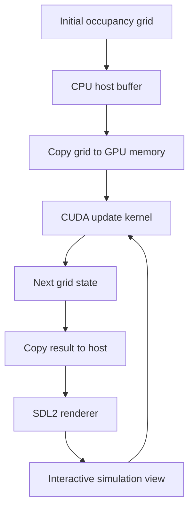

# GPU Occupancy Grid Simulator

GPU Occupancy Grid Simulator is a CUDA and C++ project for experimenting with grid-based environment dynamics. It uses a massively parallel cellular-automata update step to simulate how local state changes can propagate across a 2D occupancy map.

The project is framed around autonomous-driving research workflows, where grid representations are often used for occupancy maps, traffic-flow experiments, scene dynamics, and fast simulation loops. The simulator is intentionally lightweight: it focuses on the GPU kernel, real-time rendering, deterministic pattern loading, and interactive inspection.

## Tech Stack

- **CUDA** for parallel grid updates on the GPU
- **C++17** for simulation control and host-side orchestration
- **SDL2** for real-time rendering and interactive pan/zoom
- **CMake** for build configuration
- **GPU kernels** for cell-level state transitions

## Why This Matters

Autonomous-driving systems often reason over spatial grids: drivable space, occupied cells, traffic movement, sensor-derived occupancy, or local planning state. This project uses a simple cellular automata rule set as a sandbox for testing the mechanics of GPU-based grid simulation.

The same pattern is useful for learning:

- how to map a 2D grid onto CUDA thread blocks
- how to update many cells independently in parallel
- how to move state between CPU and GPU memory
- how to visualize evolving spatial state in real time
- how deterministic patterns can be used to test simulation behavior

## Workflow



## Features

- GPU-accelerated 2D grid simulation
- CUDA kernel for parallel next-state updates
- SDL2 renderer for live visualization
- Mouse wheel zoom
- Mouse drag panning
- Random simulation mode
- Deterministic pattern mode for repeatable behavior
- CMake-based build setup

## Project Structure

```text
gpu-occupancy-grid-sim/
├── CMakeLists.txt
├── include/
│   ├── kernel.cuh
│   ├── pattern_loader.hpp
│   └── renderer.hpp
└── src/
    ├── kernel.cu
    ├── main.cu
    ├── pattern_loader.cpp
    └── renderer.cpp
```

## Build

Requirements:

- CUDA toolkit
- C++17 compiler
- CMake
- SDL2

Build:

```bash
mkdir build
cd build
cmake ..
make
```

Run a random simulation:

```bash
./occupancy_grid_sim simulate
```

Run a deterministic pattern:

```bash
./occupancy_grid_sim observe glider
```

Supported deterministic patterns:

```text
glider
blinker
block
toad
gun
```

## Notes

This is not a full autonomous-driving stack. It is a focused GPU simulation component that demonstrates how grid-based state updates can be accelerated and visualized. The core idea is transferable to occupancy-grid experiments, traffic-cell simulations, and fast environment-state prototypes.

## Extension Ideas

- Replace the cellular-automata rule with occupancy decay, obstacle propagation, or traffic-density transitions.
- Add timing metrics around kernel launch, memory copies, and frame rendering to compare grid sizes.
- Keep deterministic pattern loading as a regression tool when changing CUDA thread/block layout.
- Use the renderer as an inspection surface, not as the source of truth; simulation state should stay in GPU/host buffers.
